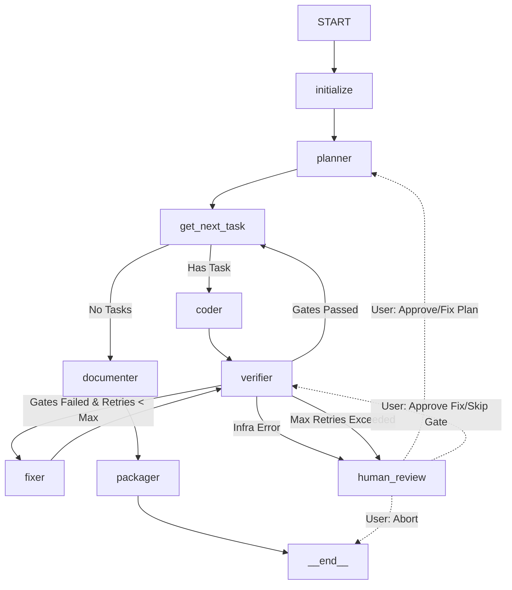

# Kernel Graph Topology & Routing Logic

**Graph Engine:** `langgraph.graph.StateGraph`
**State:** `AgentState` (from `state.py`)
**Checkpointer:** `PostgresSaver` (async)

---

## 1. Node Definitions

| Node Name | Function | Description | Retry Policy |
| :--- | :--- | :--- | :--- |
| `initialize` | `initialize_node` | Load Vertical, validate prompt, create sandbox, init state. | None (Fatal) |
| `planner` | `planner_node` | Generate `spec_markdown`, `architecture_markdown`, `task_graph`. | 1 Retry (on JSON parse fail) |
| `get_next_task` | `get_next_task_node` | **Logic Node (No LLM).** Select next PENDING task with resolved deps. Set `current_task_id`. | N/A |
| `coder` | `coder_node` | Execute Skill OR Freeform Coding. Apply FileChanges to Sandbox. | 0 (Errors caught by Verifier) |
| `verifier` | `verifier_node` | Run **ALL** Verification Gates for current task (or project). Parallel execution. | 0 |
| `fixer` | `fixer_node` | Analyze `current_gate_results`, read failed files, generate patches. | Max 3 (tracked in `fix_attempt_count`) |
| `documenter` | `documenter_node` | Generate README, ARCHITECTURE.md, API docs, Changelog. | 1 |
| `packager` | `packager_node` | Create ZIP, upload to S3/MinIO, generate `ArtifactMetadata`. | 1 |
| `human_review` | `human_review_node` | **Interrupt Node.** Pauses graph. Waits for external signal (Approve/Edit/Abort). | Infinite (Wait) |

---

## 2. Edge Definitions (Mermaid)



---

## 3. Routing Logic (Python Implementation for `graph/routing.py`)

```python
# specs/01_kernel/graph/routing.py (Reference Implementation)

from typing import Literal
from ..state import AgentState, TaskStatus, VerificationGateStatus, NodeName

def route_after_initialize(state: AgentState) -> Literal["planner", "human_review"]:
    """Check if vertical loaded correctly."""
    if state.get("error"):
        return "human_review" # Config error
    return "planner"

def route_after_planner(state: AgentState) -> Literal["get_next_task", "human_review"]:
    """Validate Planner output."""
    if not state.get("task_graph"):
        state["error"] = "Planner produced empty task graph."
        return "human_review"
    # Validate DAG (no cycles, deps exist)
    if not validate_dag(state["task_graph"]):
        state["error"] = "Planner produced invalid DAG (cycles or missing deps)."
        return "human_review"
    return "get_next_task"

def route_get_next_task(state: AgentState) -> Literal["coder", "documenter"]:
    """Pure logic: Find next runnable task."""
    pending = [t for t in state["task_graph"] if t.status == TaskStatus.PENDING]
    # Check dependencies
    completed_ids = {t.id for t in state["task_graph"] if t.status == TaskStatus.COMPLETED}
    
    for task in pending:
        if all(dep in completed_ids for dep in task.depends_on):
            # Found runnable task
            state["current_task_id"] = task.id
            # Mark IN_PROGRESS immediately to avoid race conditions in parallel runs
            # (State update happens via node return)
            return "coder"
    
    # No runnable tasks. Check if any failed/blocked.
    if any(t.status == TaskStatus.VERIFICATION_FAILED for t in state["task_graph"]):
        # This case should ideally be handled by verifier->fixer loop
        # But if we land here, something is wrong.
        state["error"] = "Deadlock: Pending tasks exist but deps unmet, and failed tasks present."
        return "human_review" # or raise Error
    
    return "documenter" # Plan complete

def route_after_verifier(state: AgentState) -> Literal["fixer", "get_next_task", "human_review"]:
    """The Core Control Flow Decision."""
    results = state.get("current_gate_results", [])
    current_task_id = state.get("current_task_id")
    
    if not current_task_id:
        return "human_review" # Invalid state

    # 1. Check for Infrastructure Errors (Sandbox down, Timeout)
    infra_errors = [r for r in results if r.status == VerificationGateStatus.ERROR]
    if infra_errors:
        state["error"] = f"Infrastructure failure in gates: {[r.gate_id for r in infra_errors]}"
        return "human_review"

    # 2. Check for Failures
    failed_gates = [r for r in results if r.status == VerificationGateStatus.FAILED]
    
    if not failed_gates:
        # SUCCESS: Mark task COMPLETED, clear fix counter, go to next
        return "get_next_task"

    # 3. FAILURE: Check Retry Budget
    task = next(t for t in state["task_graph"] if t.id == current_task_id)
    
    if task.retry_count >= state.get("max_fix_retries", 3):
        state["error"] = f"Task {current_task_id} exceeded max fix retries ({task.retry_count}). Last errors: {[r.stderr for r in failed_gates]}"
        return "human_review" # Escalate to human

    # 4. RETRY: Prepare for Fixer
    state["fix_attempt_count"] = task.retry_count + 1
    # Collect files to fix from all failed gates
    files_to_fix = set()
    for r in failed_gates:
        files_to_fix.update(r.files_to_fix)
    state["metadata"]["files_to_fix"] = list(files_to_fix)
    state["metadata"]["failed_gate_ids"] = [r.gate_id for r in failed_gates]
    
    return "fixer"

def route_after_fixer(state: AgentState) -> Literal["verifier", "human_review"]:
    """Fixer either produced patches (-> verifier) or gave up (-> human)."""
    # Fixer node updates task.file_changes and increments task.retry_count
    # If fixer returns empty patches / error -> human
    if state.get("error") and "Fixer failed" in state["error"]:
        return "human_review"
    return "verifier"

def route_after_documenter(state: AgentState) -> Literal["packager", "human_review"]:
    if state.get("error"):
        return "human_review"
    return "packager"

def route_after_packager(state: AgentState) -> Literal["__end__", "human_review"]:
    if state.get("error"):
        return "human_review"
    return "__end__"

# --- Helper ---
def validate_dag(tasks: list) -> bool:
    """Simple Kahn's algorithm check."""
    # Implementation omitted for brevity. Must check cycles & valid dep IDs.
    return True
```

---

## 4. Node Signatures (Contract for `graph/nodes/*.py`)

All nodes **MUST** follow this signature:
```python
async def node_name(state: AgentState, config: RunnableConfig) -> Dict[str, Any]:
    """
    Returns a PARTIAL state update (dict).
    LangGraph merges this into the main state.
    Keys not returned remain unchanged.
    """
    # 1. Extract config (vertical, llm_client, tool_registry, sandbox)
    vertical: IVertical = config["configurable"]["vertical"]
    tool_registry: ToolRegistry = config["configurable"]["tool_registry"]
    llm_client: ILLMClient = config["configurable"]["llm_client"]
    
    # 2. Logic...
    
    # 3. Return delta
    return {
        "status": RunStatus.CODING,
        "updated_at": datetime.utcnow(),
        "task_graph": new_task_graph, # Full list replacement
        "logs": [f"[{node_name}] Started task {task_id}"],
        "token_usage": updated_token_usage, # Full replacement (aggregated)
    }
```

---

## 5. Checkpointing Strategy

*   **Checkpoint After:** `planner`, `coder` (after file write), `verifier`, `fixer`, `documenter`, `packager`.
*   **Checkpoint Key:** `thread_id` = `run_id` (passed in `config.configurable.thread_id`).
*   **Serialization:** `PostgresSaver` uses `json.dumps` with custom `PydanticEncoder`.
*   **Resume Logic:** Gateway calls `graph.ainvoke(None, config={"configurable": {"thread_id": run_id}})` with `None` input to resume from last checkpoint.

---

## 6. Human-in-the-Loop (HITL) Interrupts

Implemented via `NodeInterrupt` (LangGraph native) or `graph.update_state` from external API.

**Interrupt Points:**
1.  **Post-Planner:** User reviews `spec_markdown` + `task_graph`. Actions: `Approve`, `Edit Plan`, `Abort`.
2.  **Post-Verifier (Max Retries):** User sees error logs. Actions: `Skip Gate`, `Edit Code Manually`, `Abort`.
3.  **Pre-Destructive Action:** `packager` about to overwrite production artifact (optional).

**Interrupt Payload (sent to UI via WebSocket):**
```json
{
  "run_id": "...",
  "interrupt_type": "plan_review",
  "payload": {
    "spec_markdown": "...",
    "task_graph": [...],
    "estimated_cost_usd": 0.45
  },
  "actions": ["approve", "edit_plan", "abort"]
}
```
