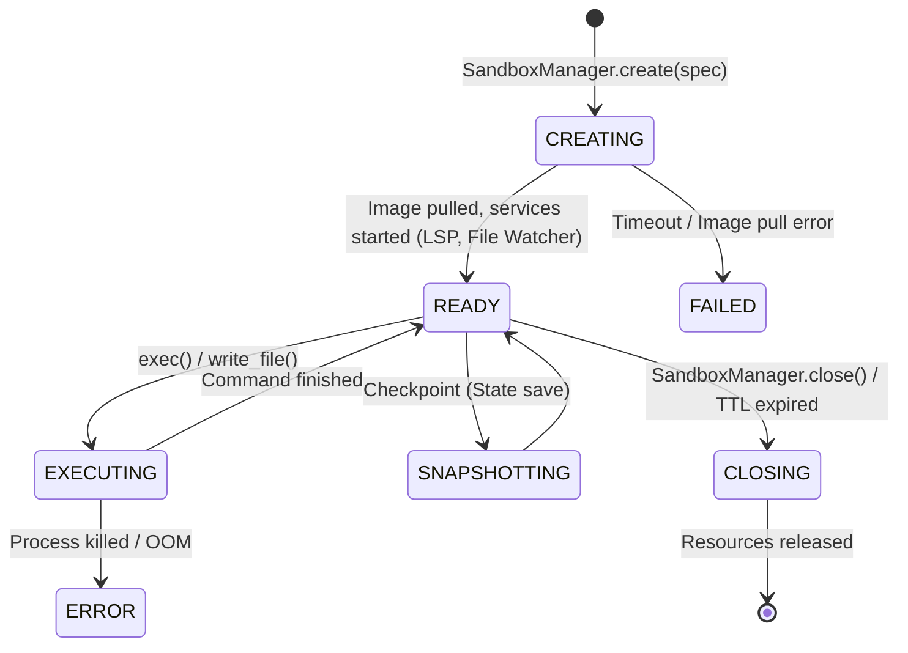

# Sandbox Execution Environment Specification

**Goal:** Secure, reproducible, language-agnostic code execution with LSP support.

## 1. Architecture Options (Priority Order)

| Provider | Pros | Cons | Use Case |
| :--- | :--- | :--- | :--- |
| **E2B (Code Interpreter SDK)** | Best DX, built-in FS/Shell/Net tools, persistent sessions, Python/JS/Go/Rust support, **File Watcher API**. | Cost (managed), Vendor lock-in (mitigated by our `ISandbox` protocol). | **Default for MVP & Cloud.** |
| **Daytona** | Open Source, Kubernetes-native, "Workspace" concept, GPU support, SSH access. | Self-host ops overhead. | **Enterprise On-Prem / GPU workloads.** |
| **Modal / Fly.io Machines** | Serverless, fast cold start (<1s), GPU, custom images. | API differs from "persistent VM" model. | **Burst scaling / CI jobs.** |
| **Custom Docker (gVisor/Kata)** | Full control, zero cost (own iron), max isolation. | High implementation effort (snapshots, networking, file sync). | **Air-gapped / High Security.** |

**Decision:** Implement `ISandbox` for **E2B** first (fastest MVP). Add `DaytonaProvider` later. Protocol ensures zero kernel changes.

---

## 2. Sandbox Lifecycle & State



### Critical Runtime Requirements (Base Image)
**All Vertical Sandboxes MUST inherit from `autogen-sandbox-base`**.
```dockerfile
# specs/02_infra/sandbox/DOCKERFILE.sandbox.base
FROM ubuntu:24.04 AS base

# 1. System Deps
RUN apt-get update && apt-get install -y --no-install-recommends \
    git curl wget unzip ca-certificates gnupg2 software-properties-common \
    build-essential pkg-config libssl-dev \
    # LSP Servers (Multi-lang)
    nodejs npm python3 python3-pip python3-venv golang-go \
    && rm -rf /var/lib/apt/lists/*

# 2. Universal Tools
# Tree-sitter CLI (for AST parsing in tools)
RUN npm install -g tree-sitter-cli

# 3. Language Specific LSPs (Installed globally for speed)
# TypeScript/JavaScript
RUN npm install -g typescript-language-server vscode-langservers-extracted @vue/language-server
# Python
RUN pip install --no-cache-dir 'python-lsp-server[all]' ruff-lsp basedpyright
# Go
RUN go install golang.org/x/tools/gopls@latest && mv /root/go/bin/gopls /usr/local/bin/
# Rust
RUN curl --proto '=https' --tlsv1.2 -sSf https://sh.rustup.rs | sh -s -- -y && \
    ~/.cargo/bin/rustup component add rust-analyzer && \
    ln -s ~/.cargo/bin/rust-analyzer /usr/local/bin/
# Terraform
RUN wget -q https://releases.hashicorp.com/terraform/1.9.0/terraform_1.9.0_linux_amd64.zip && \
    unzip terraform_1.9.0_linux_amd64.zip -d /usr/local/bin/ && rm terraform_1.9.0_linux_amd64.zip

# 4. Code Quality Tools (Used by Verifier Gates)
RUN npm install -g eslint @typescript-eslint/parser @typescript-eslint/eslint-plugin prettier
RUN pip install --no-cache-dir mypy pytest pytest-cov bandit safety
RUN go install github.com/golangci/golangci-lint/cmd/golangci-lint@latest && \
    mv /root/go/bin/golangci-lint /usr/local/bin/
RUN cargo install cargo-audit taplo-cli

# 5. User & Permissions (Non-root for security)
ARG USERNAME=autogen
ARG USER_UID=1000
ARG USER_GID=1000
RUN groupadd --gid $USER_GID $USERNAME \
    && useradd --uid $USER_UID --gid $USER_GID -m -s /bin/bash $USERNAME
RUN echo "$USERNAME ALL=(ALL) NOPASSWD:ALL" > /etc/sudoers.d/$USERNAME

USER $USERNAME
WORKDIR /workspace
ENV PATH="/home/$USERNAME/.local/bin:/home/$USERNAME/go/bin:$PATH"
```

### Vertical-Specific Images (Example: SaaS Web)
```dockerfile
# specs/02_infra/sandbox/DOCKERFILE.sandbox.saas_web
FROM my-registry/autogen-sandbox-base:latest AS saas-web

USER root
# Node version manager (fnm) for precise versions
RUN curl -fsSL https://fnm.vercel.app/install | bash -s -- --install-dir /usr/local/bin --skip-shell
RUN fnm install 20 && fnm default 20
# pnpm
RUN npm install -g pnpm@9
# Playwright deps
RUN npx playwright install-deps chromium
USER autogen

# Pre-cache common deps (speeds up 'pnpm install' drastically)
RUN mkdir -p /workspace/.cache && chown autogen:autogen /workspace/.cache
ENV PNPM_STORE_PATH=/workspace/.cache/pnpm-store
```
