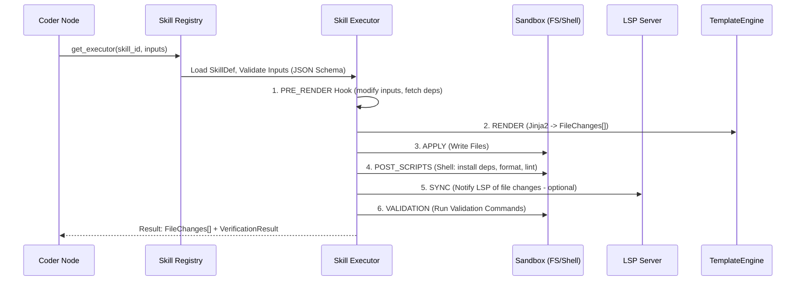

# Skills Framework Specification

**Version:** 1.0
**Core Concept:** **Skill = Template Bundle + Render Logic + Validation Gates.**
Skills are the atomic units of *deterministic* generation. They produce boilerplate, config, scaffolding, migrations — everything that follows a pattern.

---

## 1. Philosophy: Why Skills?

| Approach | Pros | Cons | Use Case |
| :--- | :--- | :--- | :--- |
| **Pure LLM Generation** | Flexible, handles novel logic | Slow, hallucinates imports, inconsistent style, token-heavy | Business logic, algorithms, complex conditionals |
| **Skills (Templates)** | **Instant**, **Deterministic**, **Type-safe**, **Reviewable**, **Versioned** | Rigid, requires maintenance | Project init, CRUD scaffolds, Config files, Dockerfiles, CI pipelines, Boilerplate patterns |

**Rule of Thumb:** If you can write a **Jinja2 template** for it with < 5 conditional branches → **Make it a Skill**. If it requires "thinking" → **LLM Agent (Coder Node)**.

---

## 2. Skill Anatomy

```
skill_id/
├── skill.yaml              # Manifest (Metadata, Inputs, Dependencies, Gates)
├── templates/              # Jinja2 Templates (.j2 files preserving directory structure)
│   ├── package.json.j2
│   └── src/...
├── hooks.py                # Optional Python Logic (Pre/Post Render, Validation, LSP edits)
└── assets/                 # Static files (images, binary blobs, large configs)
```

---

## 3. Skill Lifecycle (Execution Flow)



---

## 4. Skill Composition & Dependencies

Skills can depend on other skills (DAG).
*   `init_nextjs` → provides `package.json`, `tsconfig`.
*   `add_tailwind` → **depends_on**: `init_nextjs`. Modifies `package.json`, `tailwind.config.ts`, `globals.css`.
*   `add_shadcn_ui` → **depends_on**: `add_tailwind`. Runs `pnpm dlx shadcn-ui add button`.

**Dependency Resolution:** Handled by Planner (Task Graph). Skill Executor assumes dependencies are already applied.

---

## 5. Versioning & Marketplace

*   **SemVer:** `skill.yaml` has `version: "1.2.0"`.
*   **Registry:** Local FS (`verticals/<name>/skills/`) + Remote (GitHub Releases / OCI Registry / Custom API).
*   **Lockfile:** `skills.lock.json` in project root (generated by Planner) pins exact versions for reproducibility.
*   **Upgrade Command:** `autogen skill upgrade <skill_id> @latest` → updates lockfile, runs migration hooks.
