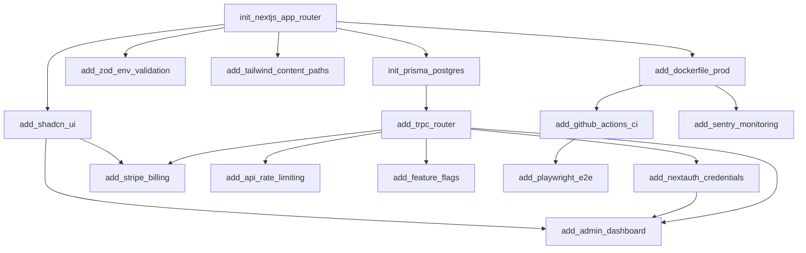

# SaaS Web Vertical — Skill Catalog

**Total Skills:** 15
**Categories:** Scaffold (4), Config (3), Feature (5), Infra (3)

| Skill ID | Category | Depends On | Description | Key Outputs |
| :--- | :--- | :--- | :--- | :--- |
| **init_nextjs_app_router** | Scaffold | — | Next.js 14 App Router, TS, Tailwind, ESLint, Prettier, Husky, pnpm | `package.json`, `tsconfig.json`, `tailwind.config.ts`, `.eslintrc`, `.prettierrc`, `next.config.mjs`, `src/app/layout.tsx`, `src/app/globals.css` |
| **init_prisma_postgres** | Scaffold | `init_nextjs` | Prisma Schema (`User`, `Account`, `Session`, `VerificationToken` for NextAuth), `DATABASE_URL`, `prisma generate` | `prisma/schema.prisma`, `.env.example`, `src/server/db/client.ts` |
| **add_trpc_router** | Feature | `init_prisma` | tRPC v11 Setup: `initTRPC`, `superjson`, `Zod`, Context, Router merge, React Query Provider | `src/trpc/*`, `src/server/api/root.ts`, `src/server/api/trpc.ts`, `src/utils/trpc.tsx` |
| **add_nextauth_credentials** | Feature | `init_prisma`, `add_trpc` | NextAuth v5 (Auth.js): Credentials + GitHub/GitHub OAuth, JWT Strategy, Middleware Protection, `auth.ts` | `src/lib/auth.ts`, `src/middleware.ts`, `src/app/(auth)/login`, `src/app/api/auth/[...nextauth]/route.ts` |
| **add_stripe_billing** | Feature | `add_nextauth`, `add_trpc` | Stripe Subscriptions: Products/Prices, Checkout Portal, Webhooks (`stripe-webhook`), Prisma `Subscription` model | `src/server/api/routers/billing.ts`, `src/app/api/webhooks/stripe/route.ts`, `prisma/schema.prisma` (updates) |
| **add_shadcn_ui** | Config | `init_nextjs` | `pnpm dlx shadcn-ui@latest add button input form dialog toast...` + `cn` utility, `TailwindAnimate` | `components.json`, `src/components/ui/*`, `src/lib/utils.ts` |
| **add_admin_dashboard** | Feature | `add_nextauth`, `add_shadcn`, `add_trpc` | Admin Panel: User Table (TanStack Table), Impersonation, Role Management, Stats Cards | `src/app/(dashboard)/admin/*`, `src/server/api/routers/admin.ts` |
| **add_dockerfile_prod** | Infra | `init_nextjs` | Multi-stage Dockerfile: Base -> Builder -> Runner. Standalone output. Non-root user. Healthcheck. | `Dockerfile`, `.dockerignore`, `docker-compose.yml` (app, db, redis) |
| **add_github_actions_ci** | Infra | `init_nextjs` | CI Pipeline: Lint, Typecheck, Test (Unit+E2E), Build, Docker Build/Push, Deploy Preview. | `.github/workflows/ci.yml`, `.github/workflows/deploy.yml` |
| **add_playwright_e2e** | Config | `add_nextauth` | Playwright Config: Auth setup (storageState), Test Utils, CI Reporter, Critical Path Tests. | `playwright.config.ts`, `tests/e2e/*.spec.ts`, `tests/auth.setup.ts` |
| **add_sentry_monitoring** | Infra | `add_dockerfile` | Sentry Init (Client/Server/Edge), Source Maps Upload, Performance Tracing. | `sentry.client.config.ts`, `sentry.server.config.ts`, `sentry.edge.config.ts`, `next.config.mjs` (updates) |
| **add_tailwind_content_paths** | Config | `add_shadcn` | Auto-configures `content` in `tailwind.config.ts` for all `src/**` + shadcn paths. | `tailwind.config.ts` (update) |
| **add_zod_env_validation** | Config | `init_nextjs` | `src/env.mjs` using `@t3-oss/env-nextjs` for type-safe `process.env`. | `src/env.mjs`, `.env.example` (update) |
| **add_api_rate_limiting** | Feature | `add_trpc` | tRPC Middleware: Upstash Redis / In-Memory Rate Limiter per User/IP. | `src/server/api/trpc.ts` (middleware), `src/lib/rate-limit.ts` |
| **add_feature_flags** | Feature | `add_trpc` | LaunchDarkly / Unleash / Custom Provider integration via tRPC Context. | `src/lib/flags.ts`, `src/server/api/trpc.ts` (context) |

---

### Skill Dependency Graph (Mermaid)

