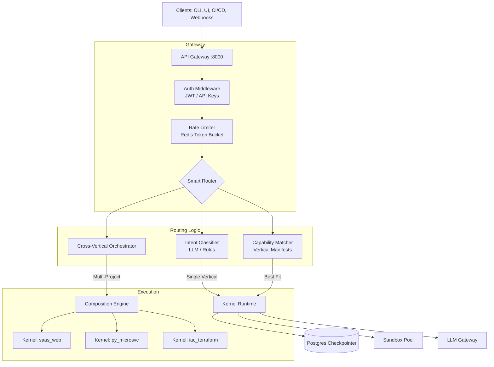

# Gateway Specification: Unified API & Cross-Vertical Orchestration

## 1. Architecture Overview

## 2. API Design Principles

| Principle | Implementation |
| :--- | :--- |
| **Async First** | All endpoints `async`, long-running ops return `202 Accepted` + `run_id` + WebSocket URL. |
| **Idempotency** | `Idempotency-Key` header for `POST /generate` (safe retries). |
| **Streaming** | `text/event-stream` for logs, `websocket` for real-time state. |
| **Versioning** | URL versioning `/api/v1/`, Protobuf/gRPC for internal high-perf. |
| **Observability** | `X-Request-ID` propagated everywhere. Structured JSON logs. |

## 3. Cross-Vertical Orchestration (The "Composer")

**Use Case:** "Build me a SaaS: Next.js Frontend + FastAPI Billing Service + Terraform AWS Infra".

**Flow:**
1.  **Decompose:** Planner (Meta-Agent) splits PRD into Sub-Projects per Vertical.
2.  **Contract Definition:** Generates **Shared Contracts** (OpenAPI, Protobuf, SQL Schemas, Event Schemas).
3.  **Parallel Generation:** Spawns independent Kernel Runs per Vertical with injected Contracts.
4.  **Synchronization:** Waits for `Contract Stabilization` (API signatures frozen).
5.  **Integration Tests:** Spins up `docker-compose` with all services, runs contract tests.
6.  **Aggregation:** Merges artifacts, generates root `README`, `ARCHITECTURE`, `docker-compose.yml`, `skaffold.yaml`.

## 4. Security Model

- **Authentication:** JWT (Auth0/Clerk/Custom) + API Keys (for CI/CD).
- **Authorization:** RBAC per Vertical (`admin`, `developer`, `viewer`).
- **Tenancy:** `X-Tenant-ID` header isolates workspaces, sandboxes, knowledge bases.
- **Secrets:** Injected at runtime via Vault/Secrets Manager, never in State.
